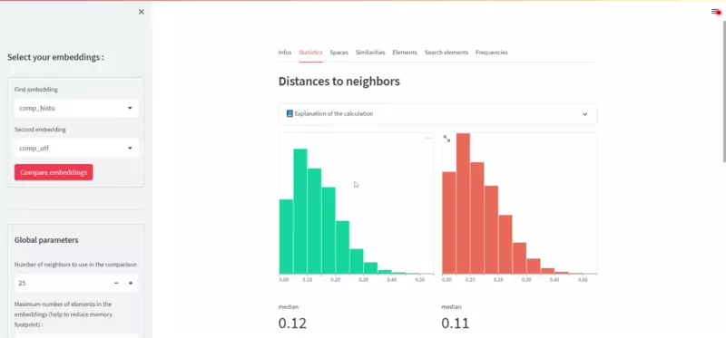

<div align="center">
    
    
    
    <a href="https://www.gnu.org/licenses/agpl-3.0">
    
        
    </a>
    <a href="https://github.com/PyCQA/bandit">
        
    </a>
    
</div>

<div align="center">
    <h1>EmbCompare</h1>
    <p ><b>A simple python tool for embedding comparison</b></p>
</div>

EmbCompare is a small python package highly inspired by the [Embedding Comparator tool](https://github.com/mitvis/embedding-comparator) 
that helps you compare your embeddings both visually and numerically.

### Key features : 
- **Visual comparison** : GUI for comparison of two embeddings
- **Numerical comparison** : Calculation of comparison indicators between two embeddings for monitoring purposes

> EmbCompare keeps things simples. All computations are made in memory and the package does not bring any embedding storage management.
>
> If you need a tool to store, compare and track your experiments, you may like the [vectory](https://github.com/pentoai/vectory) project.

# Table of content

- [Table of content](#table-of-content)
- [🛠️ Installation](#️-installation)
- [👩‍💻 Usage](#-usage)
  - [Config file](#config-file)
  - [JSON comparison report generation](#json-comparison-report-generation)
  - [GUI](#gui)
- [🐍 Python API](#-python-api)
  - [Embedding](#embedding)
  - [EmbeddingComparison](#embeddingcomparison)
  - [JSON reports](#json-reports)
    - [EmbeddingReport](#embeddingreport)
    - [EmbeddingComparisonReport](#embeddingcomparisonreport)
- [📊 Create your custom streamlit app](#-create-your-custom-streamlit-app)

# 🛠️ Installation

```bash
# basic install
pip install embcompare

# installation with the gui tool
pip install embcompare[gui]
```

# 👩‍💻 Usage

EmbCompare provides a CLI with three sub-commands : 

- `embcompare add` is used to create or update a yaml file containing all embeddings infos : path, format, labels, term-frequencies, ... ;
- `embcompare report` is used to generate json reports containing comparison metrics ;
- `embcompare gui` is used to start a [streamlit](https://streamlit.io/) webapp to compare your embeddings visually.

## Config file

EmbCompare use a yaml file for referencing embeddings and relevant informations. By default, EmbCompare is looking
for a file named embcompare.yaml in the current working directory.

```yaml
embeddings: 
    first_embedding:
        name: My first embedding
        path: /abspath/to/firstembedding.json
        format: json
        frequencies: /abspath/to/freqs.json
        frequencies_format: json
        labels: /abspath/to/labels.pkl
        labels_format: pkl
    second_embedding:
        name: My second embedding
        path: /abspath/to/secondembedding.json
        format: word2vec
        frequencies: /abspath/to/freqs.pkl
        frequencies_format: pkl
        labels: /abspath/to/labels.json
        labels_format: json
```

The `embcompare add` command allow to update this file programatically (and even create it if it does not exist).

## JSON comparison report generation

EmbCompare aims to help to compare embedding thanks to numerical metrics that can be used to check if a new
generated embedding is very different from the last one. The command `embcompare report` can be used in two ways : 
- With a single embedding. In this case it generate a small report about the embedding : 
  ```bash
  embcompare report first_embedding
  # creates a first_embedding_report.json file containing some infos about the embedding
  ```
- With two embeddings. In this case it generate a comparison report about the two embeddings : 
  ```bash
  embcompare report first_embedding second_embedding
  # creates a first_embedding_second_embedding_report.json file containing comparison metrics
  ```

## GUI



The GUI is also very handy to compare embeddings. To start the GUI, use the commande `embcompare gui`. 
It will launch a streamlit app that will allow you to visually compare the embeddings you added in the configuration file.

# 🐍 Python API

EmbCompare provide several classes to load and compare embeddings. 
## Embedding

The `Embedding` class is child of the [`gensim.KeyedVectors`](https://radimrehurek.com/gensim/models/keyedvectors.html) class.

It add few functionalities : 
- You can provide term frequencies so you can filter the elements later
- You can easily compute all elements nearest neighbors (thanks to 
  [sklearn.neighbors.NearestNeighbors](https://scikit-learn.org/stable/modules/generated/sklearn.neighbors.NearestNeighbors.html))

```python
import json
import gensim.downloader as api
from embcompare import Embedding

word_vectors = api.load("glove-wiki-gigaword-100")
with open("frequencies.json", "r") as f:
  word_frequencies = json.load(f)

embedding = Embedding.load_from_keyedvectors(word_vectors, frequencies=word_frequencies)
neigh_dist, neigh_ind = embedding.compute_neighborhoods()
```
## EmbeddingComparison

The `EmbeddingComparison` class is meant to compare two `Embedding` objects : 

```python
from embcompare import EmbeddingComparison, load_embedding

emb1 = load_embedding("first_emb.bin", embedding_format="fasttext", frequencies_path="freqs.pkl")
emb2 = load_embedding("second_emb.bin", embedding_format="word2vec", frequencies_path="freqs.pkl")

comparison = EmbeddingComparison({"emb1": emb1, "emb2": emb2}, n_neighbors=25)
comparison.neighborhoods_similarities["word"]
# 0.867
```
## JSON reports
### EmbeddingReport
The `EmbeddingReport` class is used to generate small report about an embedding : 

```python
from embcompare import EmbeddingReport, load_embedding

emb1 = load_embedding("first_emb.bin", embedding_format="fasttext", frequencies_path="freqs.pkl")
report = EmbeddingReport(emb1)
report.to_dict()
# { 
#   "vector_size": 300,
#   "mean_frequency": 0.00012,
#   "mean_distance_neighbors": 0.023,
#   ...
# }
```

### EmbeddingComparisonReport
The `EmbeddingComparisonReport` class is used to generate small comparison report from two embedding : 

```python
from embcompare import EmbeddingComparison, EmbeddingComparisonReport, load_embedding

emb1 = load_embedding("first_emb.bin", embedding_format="fasttext", frequencies_path="freqs.pkl")
emb2 = load_embedding("second_emb.bin", embedding_format="word2vec", frequencies_path="freqs.pkl")

comparison = EmbeddingComparison({"emb1": emb1, "emb2": emb2})
report = EmbeddingComparisonReport(comparison)

report.to_dict()
# {
#   "embeddings" : [
#     { 
#       "vector_size": 300,
#       "mean_frequency": 0.00012,
#       "mean_distance_neighbors": 0.023,
#       ...
#     },
#     ...
#   ],
#   "neighborhoods_similarities_median": 0.012,
#   ...
# }
```

# 📊 Create your custom streamlit app

The GUI is built with [streamlit](https://streamlit.io/). We tried to modularized the app so you can 
more easily reuse some features for your custom streamlit app : 

```python
# embcompare/gui/app.py

from embcompare.gui.features import (
    display_custom_elements_comparison,
    display_elements_comparison,
    display_embeddings_config,
    display_frequencies_comparison,
    display_neighborhoods_similarities,
    display_numbers_of_elements,
    display_parameters_selection,
    display_spaces_comparison,
    display_statistics_comparison,
)
from embcompare.gui.helpers import create_comparison

def main():
    """Streamlit app for embeddings comparison"""
    config_embeddings = config[CONFIG_EMBEDDINGS]

    (
        tab_infos,
        tab_stats,
        tab_spaces,
        tab_neighbors,
        tab_compare,
        tab_compare_custom,
        tab_frequencies,
    ) = st.tabs(
        [
            "Infos",
            "Statistics",
            "Spaces",
            "Similarities",
            "Elements",
            "Search elements",
            "Frequencies",
        ]
    )

    # Embedding selection (inside the sidebar)
    with st.sidebar:
        parameters = display_parameters_selection(config_embeddings)

    # Display informations about embeddings
    with tab_infos:
        display_embeddings_config(
            config_embeddings, parameters.emb1_id, parameters.emb2_id
        )

    comparison = create_comparison(
        config_embeddings,
        emb1_id=parameters.emb1_id,
        emb2_id=parameters.emb2_id,
        n_neighbors=parameters.n_neighbors,
        max_emb_size=parameters.max_emb_size,
        min_frequency=parameters.min_frequency,
    )

    # Display number of element in both embedding and common elements
    with tab_infos:
        display_numbers_of_elements(comparison)

    # Display statistics
    with tab_stats:
        display_statistics_comparison(comparison)

    if not comparison.common_keys:
        st.warning("The embeddings have no element in common")
        st.stop()

    # Comparison below are based on common elements comparison
    with tab_spaces:
        display_spaces_comparison(comparison)

    with tab_neighbors:
        display_neighborhoods_similarities(comparison)

    with tab_compare:
        display_elements_comparison(comparison)

    with tab_compare_custom:
        display_custom_elements_comparison(comparison)

    with tab_frequencies:
        display_frequencies_comparison(comparison)
```
